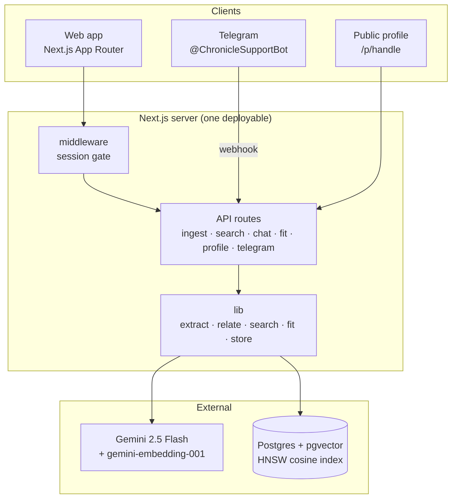
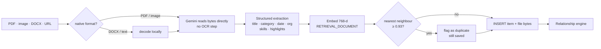
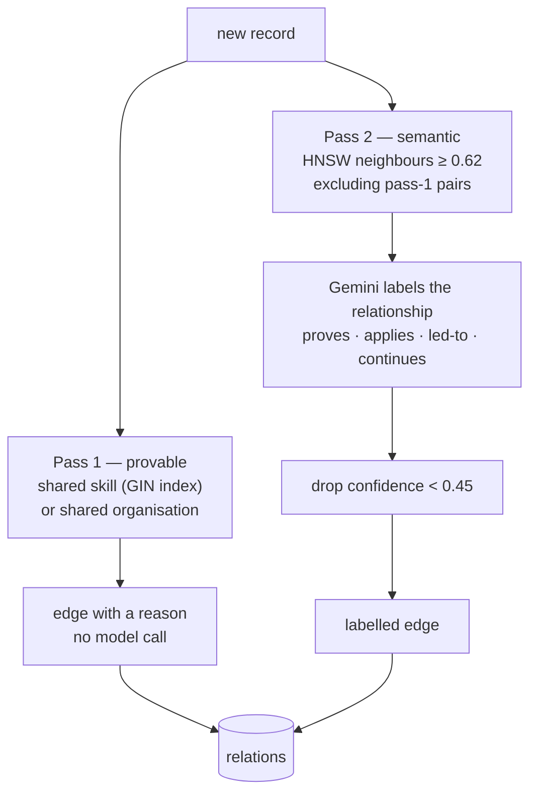
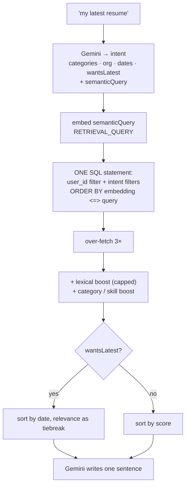
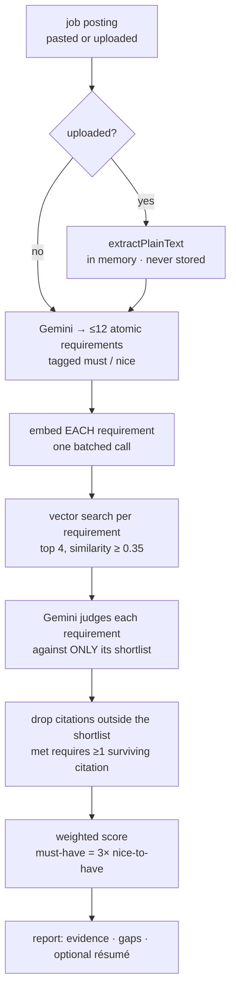
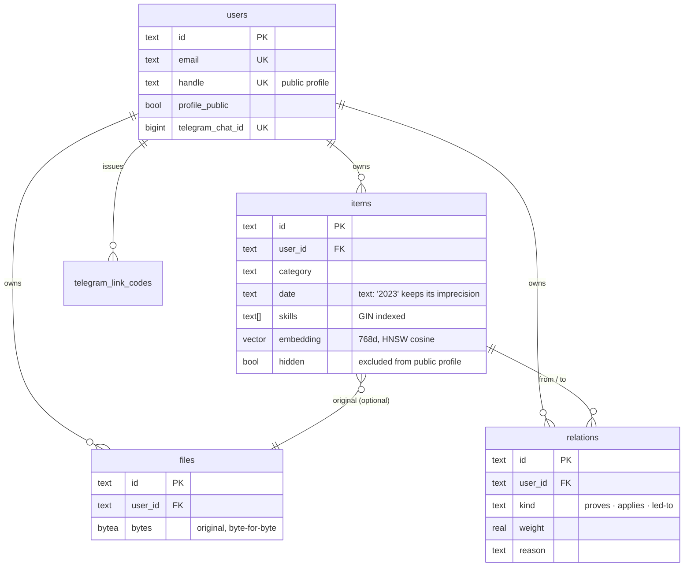

# Architecture

Chronicle is a single Next.js application. The UI and every API route ship in
one deployable; the only external services are Postgres and the Gemini API.

---

## System

---

## Ingestion pipeline

One upload becomes an understood, embedded, connected record.

The duplicate check runs **before** the insert — afterwards the new row would be
its own nearest neighbour.

---

## Relationship engine

Two passes, because the two kinds of connection have different epistemics.

Pass 1 costs nothing and cannot be wrong. Pass 2 is where the interesting links
live — a project that grew out of a course, an internship that followed a
certification — and it is the only part that needs a model.

Candidates come from `relationCandidates()`, which unions skill/org overlap with
vector neighbours **for that user only**. The whole table is never loaded.

---

## Retrieval

Structured filters and vector ranking run in the **same statement**, so Postgres
narrows before ranking rather than after.

---

## Opportunity Fit

The most involved pipeline, and the one that justifies the graph existing.

Two decisions carry this feature:

**Retrieval-first.** Each requirement is embedded and matched separately, so the
model only ever sees records that are already plausibly relevant. Token cost
scales with the number of requirements, not the size of the Chronicle.

**Citation verification.** Any record id the model returns that was not in that
requirement's shortlist is discarded, and `met` requires at least one surviving
citation. The value of the feature is that the evidence is real, so it is
enforced in code rather than requested in a prompt.

---

## Data model

**`date` is `text`, not `date`.** A certificate may assert only "2023"; coercing
that to `2023-01-01` would invent precision the source never had.

**Files live in Postgres as `bytea`** so one `DATABASE_URL` is the entire setup
and originals survive an ephemeral filesystem.

---

## Multi-tenancy

Every function in `store.ts` takes `userId` as its **first required argument**,
and every statement filters on it. There is deliberately no unscoped read — a
caller cannot fetch another account's records because no such function exists,
and adding a query that forgets the owner is a compile error.

Ownership is checked in the `WHERE` clause rather than in JavaScript after
fetching, so a guessed id returns nothing instead of returning data that then
has to be filtered.

Verified with a suite that asserts, against real Postgres, that user A cannot
read, search, delete or vector-match user B's records — including querying A's
Chronicle with B's *exact* embedding.

---

## Request boundaries

| Surface | Auth | Notes |
|---|---|---|
| `/`, `/login` | none | marketing + sign-in |
| `/p/<handle>` | none | metadata only; explicit column list, no files |
| `/api/public/<handle>` | none | 404 unless `profile_public` |
| everything else | session required | middleware redirects, routes re-check |
| `/api/telegram/webhook` | secret header | chat resolves to exactly one account |

Middleware is **not** the authorisation boundary — every API route calls
`requireUser()` independently. Middleware only spares signed-out visitors a
flash of empty UI. That separation is what kept data safe during the Next.js
middleware-bypass CVE (patched in 15.5.20).

---

## Failure behaviour

Each layer degrades on its own rather than taking the app down.

| Failure | Result |
|---|---|
| No Gemini key | Lexical ranking still returns records; the bot says so once |
| Embedding call fails | Query falls back to the full table |
| Answer generation fails | A deterministic summary line is used |
| Relationship labelling fails | Edges persist unlabelled rather than being lost |
| Telegram send fails | Reported in chat; webhook still returns 200 so Telegram does not retry the whole search |
